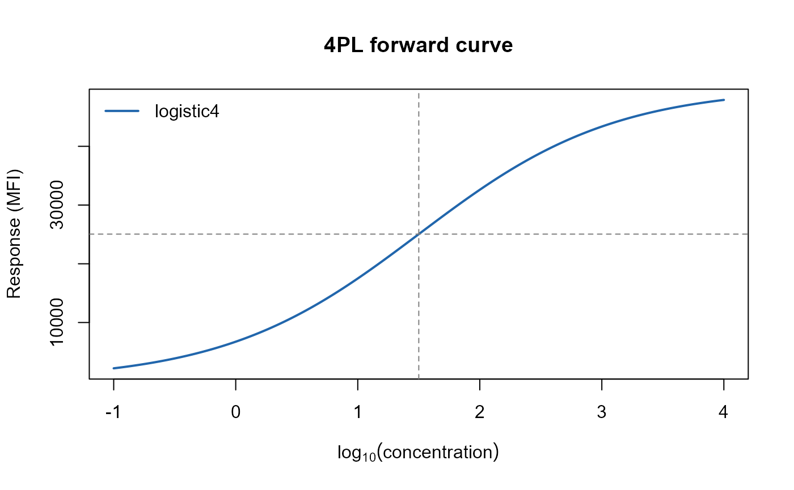
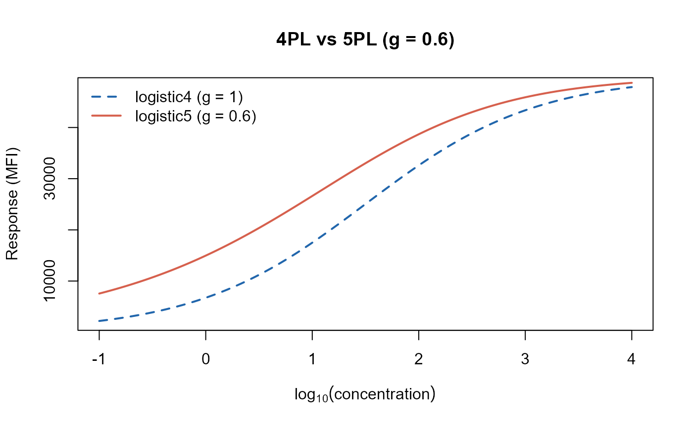
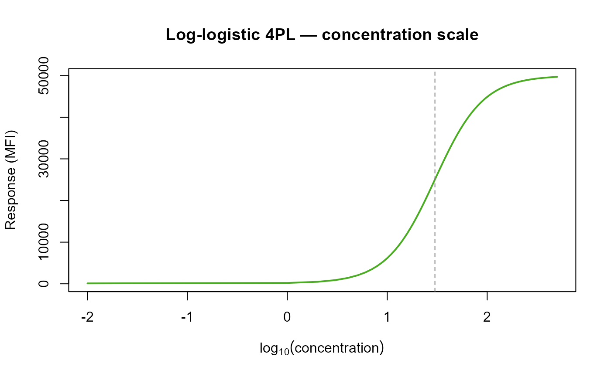
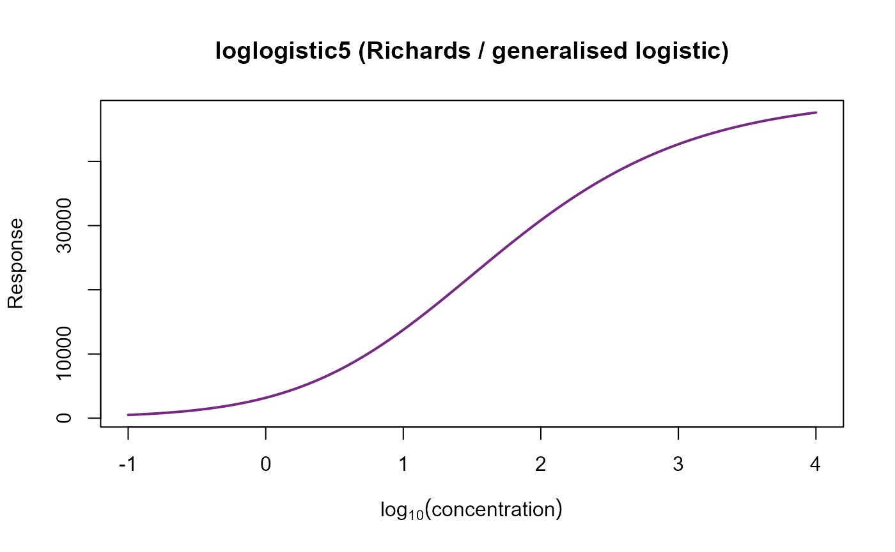
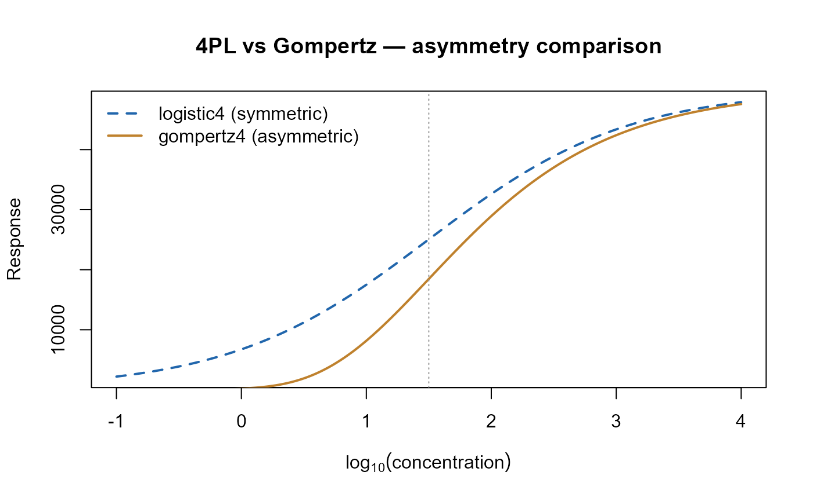
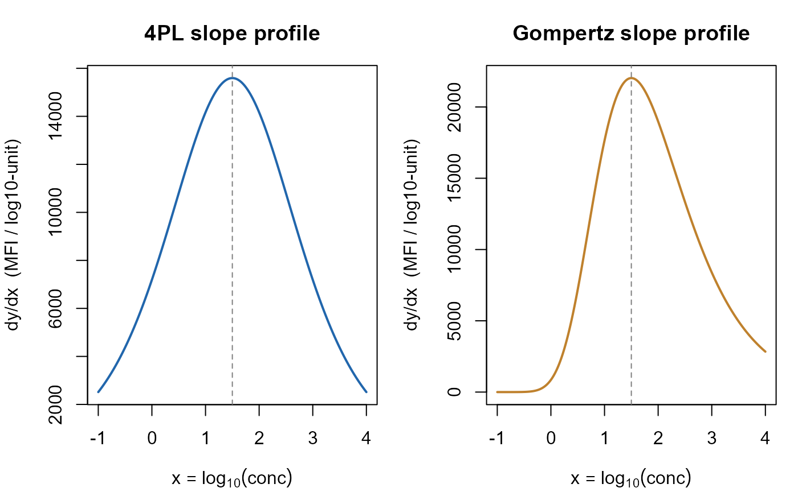
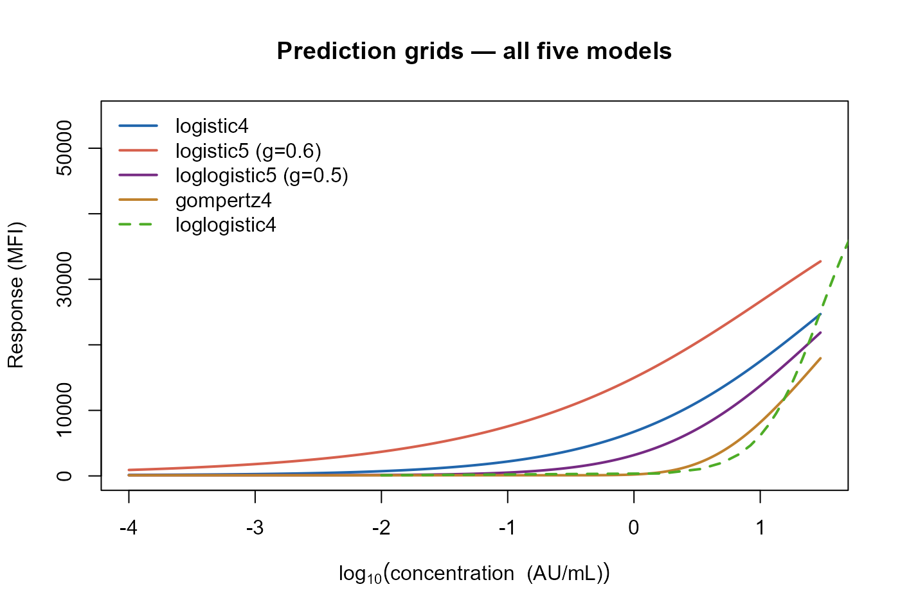

# Model Forms: Mathematics of the Five curveRcore Calibration Models

------------------------------------------------------------------------

## Introduction

This vignette is a self-contained mathematical reference for the five
sigmoidal calibration-curve models implemented in **curveRcore**. It
documents the forward functions, their analytical inverses, first and
second derivatives, the gradient-factory used for delta-method error
propagation, and the prediction-grid utilities shared by **curveRfreq**
and **curveRbayes**.

No model fitting is performed here. The audience is a statistician or
assay scientist who wants to understand the mathematics before—or
independently of—running a full calibration workflow. For a worked
end-to-end analysis, see the companion vignette *Calibration Curve
Workflows*.

### Notation and conventions

All five models share the following parameter convention, enforced
across the entire curveR ecosystem:

| Symbol | Role                                          | Constraint      |
|--------|-----------------------------------------------|-----------------|
| $`a`$  | Lower asymptote (baseline response)           | $`a < d`$       |
| $`b`$  | Scale / slope parameter                       | $`b > 0`$       |
| $`c`$  | Inflection-point location on the $`x`$-axis   | real            |
| $`d`$  | Upper asymptote (saturation response)         | $`d > a`$       |
| $`g`$  | Asymmetry parameter (5-parameter models only) | $`g > 0`$       |
| $`x`$  | Independent variable passed to the model      | model-dependent |

The independent variable $`x`$ is **scale-agnostic**: any monotone
transformation (e.g. $`x = \log_{10}(\text{concentration})`$) is applied
*upstream* in R before the model is called. The models themselves do not
perform any transformation internally, except `loglogistic4` and
`loglogistic5`, which require $`x > 0`$ on the raw (un-logged)
concentration scale.

------------------------------------------------------------------------

## Forward Model Equations

### Four-Parameter Logistic (4PL) — `logistic4`

``` math

y = a + \frac{d - a}{1 + \exp\!\left(-\dfrac{x - c}{b}\right)}
\tag{4PL}
```

The 4PL is symmetric about its inflection point $`(c,\,(a+d)/2)`$. It is
the workhorse model for log-linear immunoassay standard curves.

``` r
# Parameter set used throughout this vignette
p4 <- list(a = 100, b = 0.8, c = 1.5, d = 50000)

x_seq <- seq(-1, 4, length.out = 300)
y_4pl <- logistic4(x_seq, p4$a, p4$b, p4$c, p4$d)

plot(x_seq, y_4pl, type = "l", lwd = 2, col = "#2166AC",
     xlab = expression(log[10](concentration)),
     ylab = "Response (MFI)",
     main = "4PL forward curve")
abline(v = p4$c, h = (p4$a + p4$d) / 2, lty = 2, col = "grey50")
legend("topleft", legend = "logistic4", lwd = 2, col = "#2166AC", bty = "n")
```



### Five-Parameter Logistic (5PL) — `logistic5`

``` math

y = a + \frac{d - a}{\left(1 + \exp\!\left(-\dfrac{x - c}{b}\right)\right)^{g}}
\tag{5PL}
```

When $`g = 1`$ this reduces exactly to the 4PL. $`g > 1`$ compresses the
lower shoulder (skews toward the upper asymptote); $`0 < g < 1`$
compresses the upper shoulder. The inflection point shifts with $`g`$:

``` math

x_{\inf} = c + b\ln(g), \qquad
y_{\inf} = a + (d-a)\left(\frac{g}{g+1}\right)^{g}
```

``` r
p5 <- list(a = 100, b = 0.8, c = 1.5, d = 50000, g = 0.6)

y_5pl <- logistic5(x_seq, p5$a, p5$b, p5$c, p5$d, p5$g)

plot(x_seq, y_4pl, type = "l", lwd = 2, col = "#2166AC", lty = 2,
     xlab = expression(log[10](concentration)),
     ylab = "Response (MFI)",
     main = "4PL vs 5PL (g = 0.6)")
lines(x_seq, y_5pl, lwd = 2, col = "#D6604D")
legend("topleft",
       legend = c("logistic4 (g = 1)", "logistic5 (g = 0.6)"),
       lwd = 2, col = c("#2166AC", "#D6604D"), lty = c(2, 1), bty = "n")
```



### Four-Parameter Log-Logistic — `loglogistic4`

``` math

y = a + \frac{d - a}{1 + (c / x)^{b}}
\tag{LL4}
```

Here $`c > 0`$ is the EC50 on the *raw* concentration scale, and $`b`$
is the Hill coefficient. This is the classical Hill equation /
dose-response parameterisation. **Domain restriction:** requires
$`x > 0`$. When working on the $`\log_{10}`$ scale, `logistic4` is
algebraically equivalent and preferred.

``` r
p_ll4 <- list(a = 100, b = 1.8, c = 30, d = 50000)  # c is EC50 in AU/mL
x_conc <- seq(0.01, 500, length.out = 500)

y_ll4 <- loglogistic4(x_conc, p_ll4$a, p_ll4$b, p_ll4$c, p_ll4$d)

plot(log10(x_conc), y_ll4, type = "l", lwd = 2, col = "#4DAC26",
     xlab = expression(log[10](concentration)),
     ylab = "Response (MFI)",
     main = "Log-logistic 4PL — concentration scale")
abline(v = log10(p_ll4$c), lty = 2, col = "grey50")
```



### Five-Parameter Generalised Logistic (Richards) — `loglogistic5`

``` math

y = a + (d - a)\,\bigl(1 + g\,\exp(-b(x - c))\bigr)^{-1/g}
\tag{LL5}
```

This is the Richards / generalised logistic curve (Richards 1959).
Despite the name `loglogistic5`, $`x`$ here is the *log-transformed*
concentration (i.e. the model operates on the log scale). When
$`g \to 0`$ the formula approaches the Gompertz; when $`g = 1`$ it
matches the 4PL up to a parameter rescaling.

``` r
p_ll5 <- list(a = 100, b = 1.2, c = 1.5, d = 50000, g = 0.5)

y_ll5 <- loglogistic5(x_seq, p_ll5$a, p_ll5$b, p_ll5$c, p_ll5$d, p_ll5$g)

plot(x_seq, y_ll5, type = "l", lwd = 2, col = "#762A83",
     xlab = expression(log[10](concentration)),
     ylab = "Response",
     main = "loglogistic5 (Richards / generalised logistic)")
```



### Four-Parameter Gompertz — `gompertz4`

``` math

y = a + (d - a)\,\exp\!\bigl(-\exp(-b(x - c))\bigr)
\tag{G4}
```

The Gompertz is intrinsically asymmetric: it rises steeply from the
lower asymptote and approaches the upper asymptote more gradually
(Gompertz 1825). The inflection occurs at $`x = c`$, where
$`y_{\inf} = a + (d-a)/e`$.

``` r
p_g4 <- list(a = 100, b = 1.2, c = 1.5, d = 50000)

y_g4 <- gompertz4(x_seq, p_g4$a, p_g4$b, p_g4$c, p_g4$d)

plot(x_seq, y_4pl,  type = "l", lwd = 2, col = "#2166AC", lty = 2,
     xlab = expression(log[10](concentration)),
     ylab = "Response",
     main = "4PL vs Gompertz — asymmetry comparison")
lines(x_seq, y_g4, lwd = 2, col = "#BF812D")
abline(v = p_g4$c, lty = 3, col = "grey60")
legend("topleft",
       legend = c("logistic4 (symmetric)", "gompertz4 (asymmetric)"),
       lwd = 2, col = c("#2166AC", "#BF812D"), lty = c(2, 1), bty = "n")
```



### Summary comparison table

| Model | Equation kernel | Symmetry | Parameters | `x` domain |
|----|----|----|----|----|
| `logistic4` | $`(1 + e^{-(x-c)/b})^{-1}`$ | Symmetric | $`a,b,c,d`$ | $`\mathbb{R}`$ |
| `logistic5` | $`(1 + e^{-(x-c)/b})^{-g}`$ | Asymmetric | $`a,b,c,d,g`$ | $`\mathbb{R}`$ |
| `loglogistic4` | $`(1 + (c/x)^b)^{-1}`$ | Symmetric | $`a,b,c,d`$ | $`x > 0`$ |
| `loglogistic5` | $`(1 + g\,e^{-b(x-c)})^{-1/g}`$ | Asymmetric | $`a,b,c,d,g`$ | $`\mathbb{R}`$ |
| `gompertz4` | $`\exp(-e^{-b(x-c)})`$ | Asymmetric | $`a,b,c,d`$ | $`\mathbb{R}`$ |

------------------------------------------------------------------------

## Analytical Inverse Functions

Each model has a closed-form inverse that maps an observed response
$`y`$ back to the concentration scale. Two variants exist for every
model:

- **`inv_<model>(y, a, b, c, d)`** — $`a`$ is a free (estimated)
  parameter.
- **`inv_<model>_fixed(y, fixed_a, b, c, d)`** — $`a`$ is supplied as an
  external constant (e.g. from a plate blank mean), reducing Monte Carlo
  uncertainty.

All functions return `NA` for $`y`$ values outside the open interval
$`(a, d)`$.

### Inverse formulae

#### 4PL inverse

Solving $`y = a + (d-a)/(1 + e^{-(x-c)/b})`$ for $`x`$:

``` math

x = c + b\,\ln\!\frac{y - a}{d - y}
\tag{inv-4PL}
```

#### 5PL inverse

``` math

x = c - b\,\ln\!\left(\left(\frac{d - a}{y - a}\right)^{1/g} - 1\right)
\tag{inv-5PL}
```

#### Log-logistic 4PL inverse

``` math

x = \frac{c}{\displaystyle\left(\frac{d - y}{y - a}\right)^{1/b}}
\tag{inv-LL4}
```

#### Log-logistic 5PL inverse

``` math

x = c - \frac{1}{b}\,\ln\!\frac{\left(\dfrac{y-a}{d-a}\right)^{-g} - 1}{g}
\tag{inv-LL5}
```

#### Gompertz inverse

``` math

x = c - \frac{1}{b}\,\ln\!\left(-\ln\frac{y - a}{d - a}\right)
\tag{inv-G4}
```

### Worked example: round-trip verification

A useful sanity check is to confirm $`x = f^{-1}(f(x))`$ to machine
precision.

``` r
x_true <- 2.0  # log10(100 AU/mL)

# ---- 4PL ----
y_fwd  <- logistic4(x_true, p4$a, p4$b, p4$c, p4$d)
x_back <- inv_logistic4(y_fwd, p4$a, p4$b, p4$c, p4$d)
cat(sprintf("4PL   round-trip error: %.2e\n", abs(x_back - x_true)))
#> 4PL   round-trip error: 0.00e+00

# ---- 5PL ----
y_fwd  <- logistic5(x_true, p5$a, p5$b, p5$c, p5$d, p5$g)
x_back <- inv_logistic5(y_fwd, p5$a, p5$b, p5$c, p5$d, p5$g)
cat(sprintf("5PL   round-trip error: %.2e\n", abs(x_back - x_true)))
#> 5PL   round-trip error: 0.00e+00

# ---- loglogistic4 ----
x_ll4  <- log10(100)  # = 2.0; x_conc must be positive
y_fwd  <- loglogistic4(100, p_ll4$a, p_ll4$b, p_ll4$c, p_ll4$d)
x_back <- inv_loglogistic4(y_fwd, p_ll4$a, p_ll4$b, p_ll4$c, p_ll4$d)
cat(sprintf("LL4   round-trip error: %.2e\n", abs(x_back - 100)))
#> LL4   round-trip error: 1.42e-14

# ---- loglogistic5 ----
y_fwd  <- loglogistic5(x_true, p_ll5$a, p_ll5$b, p_ll5$c, p_ll5$d, p_ll5$g)
x_back <- inv_loglogistic5(y_fwd, p_ll5$a, p_ll5$b, p_ll5$c, p_ll5$d, p_ll5$g)
cat(sprintf("LL5   round-trip error: %.2e\n", abs(x_back - x_true)))
#> LL5   round-trip error: 0.00e+00

# ---- Gompertz ----
y_fwd  <- gompertz4(x_true, p_g4$a, p_g4$b, p_g4$c, p_g4$d)
x_back <- inv_gompertz4(y_fwd, p_g4$a, p_g4$b, p_g4$c, p_g4$d)
cat(sprintf("G4    round-trip error: %.2e\n", abs(x_back - x_true)))
#> G4    round-trip error: 4.44e-16
```

All errors should be at or below $`10^{-12}`$, confirming numerical
consistency between the forward and inverse functions.

### Effect of fixing $`a`$ on back-calculated concentration

When the lower asymptote $`a`$ is fixed at a known value (e.g. the mean
of blank wells), the resulting inverse uses fewer estimated parameters
and yields narrower confidence intervals.

``` r
# Suppose we know the blank mean is 95 MFI
a_fixed <- 95
y_test  <- 10000  # an observed sample MFI

x_free  <- inv_logistic4(y_test, p4$a, p4$b, p4$c, p4$d)
x_fixed <- inv_logistic4_fixed(y_test, a_fixed, p4$b, p4$c, p4$d)

cat(sprintf("Back-calculated x (a free):  %.4f\n", x_free))
#> Back-calculated x (a free):  0.3829
cat(sprintf("Back-calculated x (a fixed): %.4f\n", x_fixed))
#> Back-calculated x (a fixed): 0.3833
```

------------------------------------------------------------------------

## Derivatives

### First derivatives (dy/dx)

All first derivatives are positive when $`b > 0`$ and $`a < d`$,
confirming strict monotonicity.

#### 4PL — `dydx_logistic4`

Let $`u = \exp(-(x-c)/b)`$. Then:

``` math

\frac{dy}{dx} = \frac{(d-a)\,u}{b\,(1+u)^2}
\tag{D1-4PL}
```

The maximum slope occurs at $`x = c`$ (the inflection point), where
$`u = 1`$:

``` math

\left.\frac{dy}{dx}\right|_{x=c} = \frac{d - a}{4b}
\tag{D1-4PL-inf}
```

#### 5PL — `dydx_logistic5`

``` math

\frac{dy}{dx} = \frac{g\,(d-a)\,u}{b\,(1+u)^{g+1}}
\tag{D1-5PL}
```

The 5PL inflection is at $`x_{\inf} = c + b\ln g`$, so the maximum slope
is:

``` math

\left.\frac{dy}{dx}\right|_{x=x_{\inf}}
= \frac{(d-a)\,g^{g/(g+1) - 1/g}}{b\,(1 + g^{-1})^{g+1}}
```

#### Log-logistic 4PL — `dydx_loglogistic4`

Let $`r = (c/x)^b`$. Then:

``` math

\frac{dy}{dx} = \frac{b\,(d-a)\,r}{x\,(1+r)^2}
\tag{D1-LL4}
```

The inflection on the raw scale is at $`x = c`$, where $`r = 1`$:

``` math

\left.\frac{dy}{dx}\right|_{x=c} = \frac{d-a}{4c}
```

#### Log-logistic 5PL — `dydx_loglogistic5`

Let $`u = 1 + g\,e^{-b(x-c)}`$. Then:

``` math

\frac{dy}{dx} = b\,(d-a)\,e^{-b(x-c)}\,u^{-1/g - 1}
\tag{D1-LL5}
```

#### Gompertz — `dydx_gompertz4`

Let $`v = \exp(-b(x-c))`$. Then:

``` math

\frac{dy}{dx} = b\,(d-a)\,v\,\exp(-v)
\tag{D1-G4}
```

The Gompertz inflection is at $`x = c`$ ($`v = 1`$):

``` math

\left.\frac{dy}{dx}\right|_{x=c} = \frac{b\,(d-a)}{e}
```

### Second derivatives (d²y/dx²)

Second derivatives locate the inflection points and characterise the
curvature of each shoulder. Analytical forms exist for the 4PL and
Gompertz; numerical central-difference approximations are used for the
three remaining models.

#### 4PL (analytical) — `d2x_logistic4`

``` math

\frac{d^2y}{dx^2} = -\frac{(d-a)\,u\,(1-u)}{b^2\,(1+u)^3}
\tag{D2-4PL}
```

At $`x = c`$ ($`u = 1`$) the second derivative is zero, confirming the
inflection.

#### Gompertz (analytical) — `d2x_gompertz4`

``` math

\frac{d^2y}{dx^2} = b^2\,(d-a)\,v\,(v-1)\,\exp(-v)
\tag{D2-G4}
```

At $`x = c`$ ($`v = 1`$): $`d^2y/dx^2 = 0`$. Consistent with $`x = c`$
being the Gompertz inflection point.

#### 5PL, LL4, LL5 (numerical) — `d2x_logistic5`, `d2x_loglogistic4`, `d2x_loglogistic5`

For models where closed-form second derivatives are algebraically
unwieldy, a symmetric central-difference scheme is used with step size
$`h = 10^{-5}`$:

``` math

\frac{d^2y}{dx^2}\bigg|_x \approx
\frac{f(x+h) - 2f(x) + f(x-h)}{h^2}
```

This yields $`O(h^2)`$ accuracy; for typical parameter magnitudes the
approximation error is below $`10^{-7}`$.

### Worked example: slope at an arbitrary point and at the inflection

``` r
x_eval <- 2.0  # evaluate at log10(100) AU/mL

# ---- 4PL first derivative ----
slope_4pl <- dydx_logistic4(x_eval, p4$a, p4$b, p4$c, p4$d)
slope_inf  <- (p4$d - p4$a) / (4 * p4$b)   # analytical inflection slope
cat(sprintf("4PL  dy/dx at x=2.0  : %.2f MFI / log10-unit\n", slope_4pl))
#> 4PL  dy/dx at x=2.0  : 14164.85 MFI / log10-unit
cat(sprintf("4PL  dy/dx at x=c=%.1f: %.2f (formula: (d-a)/(4b))\n",
            p4$c, slope_inf))
#> 4PL  dy/dx at x=c=1.5: 15593.75 (formula: (d-a)/(4b))

# ---- Gompertz first derivative at inflection ----
slope_g4     <- dydx_gompertz4(p_g4$c, p_g4$a, p_g4$b, p_g4$c, p_g4$d)
slope_g4_inf <- p_g4$b * (p_g4$d - p_g4$a) / exp(1)
cat(sprintf("\nGompertz dy/dx at inflection (x=c): %.2f\n", slope_g4))
#> 
#> Gompertz dy/dx at inflection (x=c): 22028.62
cat(sprintf("Gompertz formula b*(d-a)/e        : %.2f\n", slope_g4_inf))
#> Gompertz formula b*(d-a)/e        : 22028.62

# ---- Visualise slope profile across the curve ----
slopes_4pl  <- dydx_logistic4(x_seq, p4$a, p4$b, p4$c, p4$d)
slopes_g4   <- dydx_gompertz4(x_seq, p_g4$a, p_g4$b, p_g4$c, p_g4$d)

par(mfrow = c(1, 2), mar = c(4, 4, 3, 1))

plot(x_seq, slopes_4pl, type = "l", lwd = 2, col = "#2166AC",
     xlab = expression(x == log[10](conc)),
     ylab = "dy/dx  (MFI / log10-unit)",
     main = "4PL slope profile")
abline(v = p4$c, lty = 2, col = "grey50")

plot(x_seq, slopes_g4, type = "l", lwd = 2, col = "#BF812D",
     xlab = expression(x == log[10](conc)),
     ylab = "dy/dx  (MFI / log10-unit)",
     main = "Gompertz slope profile")
abline(v = p_g4$c, lty = 2, col = "grey50")
```



``` r

par(mfrow = c(1, 1))
```

``` r
# Confirm d²y/dx² = 0 at the 4PL inflection
d2_at_inf <- d2x_logistic4(p4$c, p4$a, p4$b, p4$c, p4$d)
cat(sprintf("4PL d²y/dx² at inflection: %.2e  (expect 0)\n", d2_at_inf))
#> 4PL d²y/dx² at inflection: -0.00e+00  (expect 0)

# Numerical second derivative for the 5PL
d2_5pl_at_c <- d2x_logistic5(p5$c, p5$a, p5$b, p5$c, p5$d, p5$g)
cat(sprintf("5PL d²y/dx² at x=c      : %.4f\n", d2_5pl_at_c))
#> 5PL d²y/dx² at x=c      : -3086.3885
# Note: the 5PL inflection is at x = c + b*log(g), not at x = c
x_inf_5pl <- p5$c + p5$b * log(p5$g)
d2_5pl_at_xinf <- d2x_logistic5(x_inf_5pl, p5$a, p5$b, p5$c, p5$d, p5$g)
cat(sprintf("5PL d²y/dx² at x_inf=%.3f: %.2e  (expect ~0)\n",
            x_inf_5pl, d2_5pl_at_xinf))
#> 5PL d²y/dx² at x_inf=1.091: 3.64e-02  (expect ~0)
```

------------------------------------------------------------------------

## Gradient Factory: `make_inv_and_grad_fixed`

### Purpose

Delta-method confidence intervals for back-calculated concentrations
require three quantities for each observed response $`y`$:

1.  $`\hat{x} = f^{-1}(y;\,\hat\theta)`$ — the point estimate.
2.  $`\nabla_\theta\, x = \partial x/\partial \theta`$ — sensitivity of
    $`x`$ to each model parameter.
3.  $`\partial x/\partial y`$ — sensitivity of $`x`$ to measurement
    error in $`y`$.

The uncertainty in $`\hat{x}`$ is then:

``` math

\operatorname{Var}(\hat{x})
\approx
\bigl(\nabla_\theta\, x\bigr)^\top
\,\mathbf{V}_{\hat\theta}\,
\bigl(\nabla_\theta\, x\bigr)
\;+\;
\left(\frac{\partial x}{\partial y}\right)^2\!\sigma_y^2
\tag{DeltaVar}
```

where $`\mathbf{V}_{\hat\theta} = \operatorname{Cov}(\hat\theta)`$ is
the parameter covariance matrix and $`\sigma_y^2`$ is the assay noise
variance at $`y`$.

### API

``` r
fns <- make_inv_and_grad_fixed(model, fixed_a = NULL)
```

**Arguments**

- `model` — character string, one of `"logistic4"`, `"logistic5"`,
  `"loglogistic4"`, `"loglogistic5"`, `"gompertz4"`.
- `fixed_a` — numeric scalar or `NULL`. If non-`NULL`, $`a`$ is treated
  as a known constant and excluded from $`\nabla_\theta\, x`$, typically
  reducing the number of free parameters from 4 (or 5) to 3 (or 4).

**Return value**

A list of three closures, each with signature `function(y, p)` where `p`
is the named vector returned by `coef(fit)`:

| Closure         | Returns                                    |
|-----------------|--------------------------------------------|
| `$inv(y, p)`    | Scalar $`\hat x`$                          |
| `$grad(y, p)`   | Named numeric vector $`\nabla_\theta\, x`$ |
| `$grad_y(y, p)` | Scalar $`\partial x/\partial y`$           |

### Analytical gradient formulae

#### 4PL

Using $`x = c + b\ln\!\left(\frac{y-a}{d-y}\right)`$:

``` math

\frac{\partial x}{\partial a} = \frac{-b}{y-a}, \quad
\frac{\partial x}{\partial b} = \ln\frac{y-a}{d-y}, \quad
\frac{\partial x}{\partial c} = 1, \quad
\frac{\partial x}{\partial d} = \frac{-b}{d-y}
```

``` math

\frac{\partial x}{\partial y} = \frac{b\,(d-a)}{(y-a)(d-y)}
```

#### 5PL

Let $`T = (d-a)/(y-a)`$, $`T_g = T^{1/g}`$, $`W = T_g - 1`$:

``` math

\frac{\partial x}{\partial a} = \frac{b\,T_g}{g\,W\,(y-a)}, \quad
\frac{\partial x}{\partial b} = -\ln W, \quad
\frac{\partial x}{\partial c} = 1, \quad
\frac{\partial x}{\partial d} = \frac{-b\,T_g}{g\,W\,(d-a)}
```

``` math

\frac{\partial x}{\partial g} = \frac{b\,T_g\,\ln T}{g^2\,W}, \quad
\frac{\partial x}{\partial y} = \frac{-b\,T_g}{g\,W\,(y-a)}
```

#### Log-logistic 4PL

Let $`Q = (d-y)/(y-a)`$, $`p = 1/b`$, $`x = c/Q^p`$:

``` math

\frac{\partial x}{\partial a} = \frac{-c p\,(d-y)\,Q^{-p-1}}{(y-a)^2}, \quad
\frac{\partial x}{\partial b} = \frac{x\,\ln Q}{b^2}, \quad
\frac{\partial x}{\partial c} = Q^{-p}, \quad
\frac{\partial x}{\partial d} = c p\,Q^{-p-1}/(y-a)
```

``` math

\frac{\partial x}{\partial y} = \frac{c p\,(d-a)\,Q^{-p-1}}{(y-a)^2}
```

#### Gompertz

Let $`R = (y-a)/(d-a)`$, $`L = -\ln R > 0`$:

``` math

\frac{\partial x}{\partial a} = \frac{1}{b\,L\,(y-a)}, \quad
\frac{\partial x}{\partial b} = \frac{\ln L}{b^2}, \quad
\frac{\partial x}{\partial c} = 1, \quad
\frac{\partial x}{\partial d} = \frac{-1}{b\,L\,(d-a)}
```

``` math

\frac{\partial x}{\partial y} = \frac{1}{b\,L\,(y-a)}
```

#### Log-logistic 5PL

Let $`\rho = (y-a)/(d-a)`$, $`\rho_g = \rho^{-g}`$, $`V = \rho_g - 1`$:

``` math

\frac{\partial x}{\partial a} = \frac{\rho^{-g-1}}{b\,g\,V\,(d-a)}, \quad
\frac{\partial x}{\partial b} = \frac{\ln V - \ln g}{b^2}, \quad
\frac{\partial x}{\partial c} = 1
```

``` math

\frac{\partial x}{\partial d} = \frac{\rho^{-g-1}(y-a)}{b\,g\,V\,(d-a)^2}, \quad
\frac{\partial x}{\partial g} = \frac{1 - \ln(g V)}{b\,g^2}
```

``` math

\frac{\partial x}{\partial y} = \frac{\rho^{-g-1}}{b\,g\,V\,(d-a)}
```

### Worked example: gradient factory in action

``` r
# Simulate a coefficient vector as would come from coef(fit)
p_hat <- c(a = 100, b = 0.8, c = 1.5, d = 50000)

# Build the closure set for 4PL with a estimated freely
fns_free <- make_inv_and_grad_fixed("logistic4", fixed_a = NULL)

y_obs <- 15000  # observed MFI

x_hat  <- fns_free$inv(y_obs, p_hat)
g_hat  <- fns_free$grad(y_obs, p_hat)
gy_hat <- fns_free$grad_y(y_obs, p_hat)

cat(sprintf("Back-calculated log10(conc): %.4f\n", x_hat))
#> Back-calculated log10(conc): 0.8168
cat("Gradient w.r.t. theta:\n")
#> Gradient w.r.t. theta:
print(round(g_hat, 5))
#>        a        b        c        d 
#> -0.00005 -0.85399  1.00000 -0.00002
cat(sprintf("Gradient w.r.t. y: %.6f\n", gy_hat))
#> Gradient w.r.t. y: 0.000077

# ---- Verify against finite differences ----
eps <- 1e-6
fd_grad <- sapply(names(p_hat), function(nm) {
  p_up       <- p_hat
  p_up[[nm]] <- p_hat[[nm]] + eps
  (fns_free$inv(y_obs, p_up) - x_hat) / eps
})
cat("\nFinite-difference check (should match grad above):\n")
#> 
#> Finite-difference check (should match grad above):
print(round(fd_grad, 5))
#>        a        b        c        d 
#> -0.00005 -0.85399  1.00000 -0.00002

# ---- With fixed_a ----
fns_fixed <- make_inv_and_grad_fixed("logistic4", fixed_a = 95)
g_fixed   <- fns_fixed$grad(y_obs, p_hat[c("b", "c", "d")])
cat("\nGradient with fixed a=95 (b, c, d only):\n")
#> 
#> Gradient with fixed a=95 (b, c, d only):
print(round(g_fixed, 5))
#>        b        c        d 
#> -0.85365  1.00000 -0.00002
```

#### Applying the delta-method variance formula

``` r
# A toy parameter covariance matrix (realistic order-of-magnitude)
V_theta <- diag(c(a = 4, b = 0.002, c = 0.01, d = 250000))
rownames(V_theta) <- colnames(V_theta) <- names(p_hat)

sigma_y <- 200   # assay CV ≈ 1.3% at MFI=15000

var_x_param <- as.numeric(t(g_hat) %*% V_theta %*% g_hat)
var_x_meas  <- gy_hat^2 * sigma_y^2
var_x_total <- var_x_param + var_x_meas

cat(sprintf("Variance from parameter uncertainty: %.5f (log10 units^2)\n",
            var_x_param))
#> Variance from parameter uncertainty: 0.01159 (log10 units^2)
cat(sprintf("Variance from measurement noise    : %.5f\n", var_x_meas))
#> Variance from measurement noise    : 0.00023
cat(sprintf("Total variance in back-calculated x: %.5f\n", var_x_total))
#> Total variance in back-calculated x: 0.01182
cat(sprintf("95%% CI half-width: ± %.4f log10 units\n",
            qnorm(0.975) * sqrt(var_x_total)))
#> 95% CI half-width: ± 0.2131 log10 units
```

------------------------------------------------------------------------

## Prediction Grid Utilities

### `generate_prediction_grid`

The prediction grid is a data frame of concentration values at which the
fitted curve and its confidence band are evaluated for plotting and
interpolation. Both **curveRfreq** and **curveRbayes** use the same grid
structure, ensuring visual consistency.

``` r
generate_prediction_grid(
  std_curve_conc,
  n_grid             = 200L,
  grid_min_conc      = 1e-4,
  grid_max_conc      = NULL,
  is_log_independent = TRUE
)
```

**Key arguments**

- `std_curve_conc` — the maximum standard concentration (AU/mL). When
  `grid_max_conc = NULL`, this value is used as the upper boundary.
- `n_grid` — number of evenly-spaced grid points. Default 200 gives
  smooth curves without excessive computation.
- `grid_min_conc` — lower boundary of the grid on the raw scale. Must be
  $`> 0`$.
- `is_log_independent` — if `TRUE` (default), grid points are evenly
  spaced on the $`\log_{10}`$ scale, matching the fitting scale for
  log-transformed models; if `FALSE`, points are evenly spaced on the
  linear concentration scale.

**Return value**

A data frame with three columns:

| Column | Description |
|----|----|
| `log10_concentration` | $`\log_{10}`$ of concentration |
| `concentration` | Concentration on the raw (AU/mL) scale |
| `x_fit` | The value actually passed to the model ($`= \log_{10}c`$ when `is_log_independent = TRUE`) |

### `predict_grid_response`

Evaluates the forward model at every grid point:

``` r
predict_grid_response(grid, model_name, params)
```

Returns a numeric vector of $`\hat y`$ values of length `n_grid`.

### Worked example: building and plotting a prediction grid

``` r
# Generate a 300-point log-scale grid from 0.0001 to 30 AU/mL
grid <- generate_prediction_grid(
  std_curve_conc = 30,
  n_grid         = 300,
  grid_min_conc  = 1e-4,
  is_log_independent = TRUE
)

cat("Grid dimensions:", nrow(grid), "×", ncol(grid), "\n")
#> Grid dimensions: 300 × 3
cat("x_fit range    :", round(range(grid$x_fit), 3), "\n")
#> x_fit range    : -4 1.477
cat("conc range     :", signif(range(grid$concentration), 3), "AU/mL\n")
#> conc range     : 1e-04 30 AU/mL

# Evaluate all five models on the grid
params_4pl  <- c(a = 100, b = 0.8, c = 1.5, d = 50000)
params_5pl  <- c(a = 100, b = 0.8, c = 1.5, d = 50000, g = 0.6)
params_ll4  <- c(a = 100, b = 1.8, c = 30,  d = 50000)
params_ll5  <- c(a = 100, b = 1.2, c = 1.5, d = 50000, g = 0.5)
params_g4   <- c(a = 100, b = 1.2, c = 1.5, d = 50000)

yhat_4pl  <- predict_grid_response(grid, "logistic4",    params_4pl)
yhat_5pl  <- predict_grid_response(grid, "logistic5",    params_5pl)
yhat_ll5  <- predict_grid_response(grid, "loglogistic5", params_ll5)
yhat_g4   <- predict_grid_response(grid, "gompertz4",    params_g4)

# For loglogistic4 the grid x_fit must be on the raw (positive) scale
grid_lin <- generate_prediction_grid(
  std_curve_conc = 500, n_grid = 300,
  grid_min_conc = 0.01, is_log_independent = FALSE
)
yhat_ll4 <- predict_grid_response(grid_lin, "loglogistic4", params_ll4)
```

``` r
cols <- c("4PL"  = "#2166AC", "5PL"  = "#D6604D",
          "LL5"  = "#762A83", "G4"   = "#BF812D")

plot(grid$x_fit, yhat_4pl, type = "l", lwd = 2, col = cols["4PL"],
     xlab = expression(log[10](concentration~~"(AU/mL)")),
     ylab = "Response (MFI)",
     main = "Prediction grids — all five models",
     ylim = c(0, 55000))
lines(grid$x_fit, yhat_5pl,  lwd = 2, col = cols["5PL"])
lines(grid$x_fit, yhat_ll5,  lwd = 2, col = cols["LL5"])
lines(grid$x_fit, yhat_g4,   lwd = 2, col = cols["G4"])
lines(log10(grid_lin$concentration), yhat_ll4,
      lwd = 2, col = "#4DAC26", lty = 2)

legend("topleft", bty = "n", lwd = 2,
       legend = c("logistic4", "logistic5 (g=0.6)", "loglogistic5 (g=0.5)",
                  "gompertz4", "loglogistic4"),
       col    = c(cols, "#4DAC26"),
       lty    = c(1, 1, 1, 1, 2))
```



### Using the grid for back-calculation across a response range

``` r
# Demonstrate back-calculation at a sequence of response values
y_targets <- seq(500, 45000, by = 2000)

x_back <- inv_logistic4(y_targets, params_4pl["a"], params_4pl["b"],
                        params_4pl["c"], params_4pl["d"])

result <- data.frame(
  MFI            = y_targets,
  log10_conc     = round(x_back, 4),
  conc_AU_mL     = round(10^x_back, 3)
)
print(result)
#>      MFI log10_conc conc_AU_mL
#> 1    500    -2.3546      0.004
#> 2   2500    -0.8882      0.129
#> 3   4500    -0.3689      0.428
#> 4   6500    -0.0332      0.926
#> 5   8500     0.2220      1.667
#> 6  10500     0.4324      2.706
#> 7  12500     0.6147      4.118
#> 8  14500     0.7782      6.000
#> 9  16500     0.9286      8.484
#> 10 18500     1.0699     11.746
#> 11 20500     1.2049     16.029
#> 12 22500     1.3359     21.672
#> 13 24500     1.4647     29.156
#> 14 26500     1.5931     39.182
#> 15 28500     1.7227     52.804
#> 16 30500     1.8552     71.651
#> 17 32500     1.9928     98.348
#> 18 34500     2.1378    137.332
#> 19 36500     2.2935    196.564
#> 20 38500     2.4646    291.453
#> 21 40500     2.6580    455.020
#> 22 42500     2.8858    768.770
#> 23 44500     3.1708   1481.812
```

------------------------------------------------------------------------

## Model Selection Considerations

The table below summarises the key mathematical properties that should
guide model choice for a given assay.

| Property | 4PL | 5PL | LL4 | LL5 | Gompertz |
|----|----|----|----|----|----|
| Inflection symmetry | Symmetric | Asymmetric | Symmetric | Asymmetric | Asymmetric (fixed) |
| Inflection at $`x = c`$? | Yes | Only if $`g=1`$ | Yes | No | Yes |
| Extra shape parameter | No | Yes ($`g`$) | No | Yes ($`g`$) | No |
| Closed-form $`d^2y/dx^2`$ | Yes | No | No | No | Yes |
| Raw-scale $`x`$ required | No | No | Yes | No | No |
| Typical application | Log-linear ELISA | Asymmetric ELISA | Hill-equation dose–response | Flexible dose–response | Left-skewed saturation |

**Practical guidance:**

- Start with `logistic4`. It has the fewest parameters and closed-form
  derivatives.
- If the residuals show systematic skew in one shoulder, add the
  asymmetry parameter ($`g`$) via `logistic5`.
- Use `loglogistic4` / `loglogistic5` when you prefer to work on the raw
  concentration scale (e.g. for pharmacological IC50 reporting).
- `gompertz4` is a natural choice for bead-based multiplex assays where
  the response rises steeply from a low baseline and saturates slowly.

------------------------------------------------------------------------

## Numerical Precision Notes

1.  **Step size for numerical second derivatives.** The default
    $`h = 10^{-5}`$ gives $`O(h^2) \approx 10^{-10}`$ truncation error
    for parameters of order unity. Reduce $`h`$ if parameter magnitudes
    exceed $`10^4`$.

2.  **Asymptote guard in inverse functions.** `inv_logistic4` and
    `inv_logistic5` apply a tolerance buffer of $`10^{-6}`$ and return
    `NA` for responses within that distance of either asymptote, where
    the logit transformation diverges.

3.  **Overflow protection in Gompertz.** The data-generation helper in
    `bead_assay_example.R` caps the exponent $`u = b(\ln x - \ln c)`$ at
    30 to prevent `exp(exp(u))` overflow for extreme concentrations; the
    core `gompertz4` function does not apply this cap.

4.  **Machine precision of round-trips.** As demonstrated in Section
    @ref(sec-inverses), forward–inverse round-trips return errors at the
    level of $`\sim 10^{-13}`$, consistent with IEEE 754
    double-precision arithmetic.

------------------------------------------------------------------------

## References

Gompertz, B. 1825. “On the Nature of the Function Expressive of the Law
of Human Mortality, and on a New Mode of Determining the Value of Life
Contingencies.” *Philosophical Transactions of the Royal Society of
London* 115: 513–83. <https://doi.org/10.1098/rstl.1825.0026>.

Richards, F. J. 1959. “A Flexible Growth Function for Empirical Use.”
*Journal of Experimental Botany* 10 (2): 290–301.
<https://doi.org/10.1093/jxb/10.2.290>.

------------------------------------------------------------------------

## Session Information

``` r
sessionInfo()
#> R version 4.5.1 (2025-06-13 ucrt)
#> Platform: x86_64-w64-mingw32/x64
#> Running under: Windows 11 x64 (build 26100)
#> 
#> Matrix products: default
#>   LAPACK version 3.12.1
#> 
#> locale:
#> [1] LC_COLLATE=English_United States.utf8 
#> [2] LC_CTYPE=English_United States.utf8   
#> [3] LC_MONETARY=English_United States.utf8
#> [4] LC_NUMERIC=C                          
#> [5] LC_TIME=English_United States.utf8    
#> 
#> time zone: America/New_York
#> tzcode source: internal
#> 
#> attached base packages:
#> [1] stats     graphics  grDevices utils     datasets  methods   base     
#> 
#> other attached packages:
#> [1] curveRcore_0.3.0
#> 
#> loaded via a namespace (and not attached):
#>  [1] digest_0.6.39     desc_1.4.3        R6_2.6.1          fastmap_1.2.0    
#>  [5] xfun_0.57         cachem_1.1.0      knitr_1.51        htmltools_0.5.9  
#>  [9] rmarkdown_2.31    lifecycle_1.0.5   cli_3.6.6         sass_0.4.10      
#> [13] pkgdown_2.2.0     textshaping_1.0.5 jquerylib_0.1.4   systemfonts_1.3.2
#> [17] compiler_4.5.1    rstudioapi_0.18.0 tools_4.5.1       ragg_1.5.1       
#> [21] bslib_0.11.0      evaluate_1.0.5    yaml_2.3.12       otel_0.2.0       
#> [25] jsonlite_2.0.0    htmlwidgets_1.6.4 rlang_1.2.0       fs_2.1.0
```

------------------------------------------------------------------------
